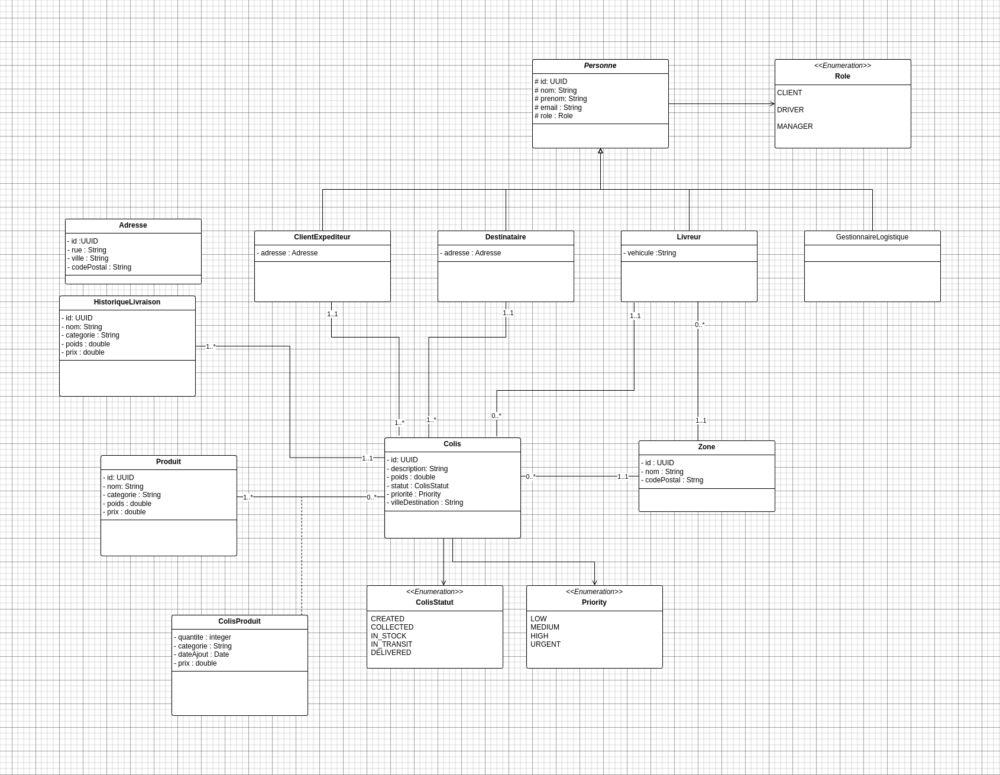

# SmartLogiDMS – Smart Delivery Management System  
*(DDD-inspired Spring Boot API for parcel logistics)*

---

## Description
SmartLogiDMS is a **logistics management system** for **SmartLogi**, a Moroccan parcel delivery company. It automates operations, ensures **full traceability**, reduces errors, and optimizes delivery routes.

### Key Objectives
- Centralize management of **clients, recipients, parcels, drivers, zones**
- Track **full parcel lifecycle**: Collect → Stock → Transit → Deliver
- Enable **precise search & tracking** by city, zone, status, priority
- Provide **complete audit history**
- Optimize routes & support **decision-making**

Built with **Spring Boot**, **PostgreSQL**, **JPA**, **MapStruct**, **Liquibase**, **Swagger**, and **AOP logging**.

---

## DDD Architecture (Concise)

| DDD Concept         | Implementation |
|---------------------|----------------|
| **Bounded Contexts** | `delivery` (colis, product) • `masterdata` (client, driver, zone) |
| **Aggregate**        | `Colis` (root) owns `ColisProduit`, controls lifecycle & status |
| **Domain Service**   | `ColisServiceImpl` → status transitions, validation |
| **Value Object**     | `ColisProduit`, `Adresse` |
| **Ubiquitous Language** | `colis`, `expediteur`, `livreur`, `zone`, `statut` |
| **Layering**         | `domain` → model • `service` → rules • `api` → DTOs |

---

## Type-Safe & Generic Design

### ID Strategies

```java
StringBaseEntity → "acc0db6b-..." (UUID strings)
UuidBaseEntity   → java.util.UUID
LongBaseEntity   → Auto-increment Long

```

### Delete Strategies
- **Soft Delete**: `deleted = true` + `@SQLRestriction("deleted = false")`
- **Hard Delete**: Direct `DELETE`

### Generic CRUD
```java
StringCrudServiceImpl<Colis, ColisRequestDTO, ColisResponseDTO>
```
→ Reusable, **type-safe**, zero duplication.

---

## Dynamic Search & Filter (JPA Specifications)

```http
?filter=statut:eq:IN_TRANSIT&poids:gt:5&reference:like:Casablanca
?search=Laptop
```

→ `GenericSpecification<T>` + `FilterParser`  
→ Reusable across **all aggregates**

---

## Key Endpoints

| Method | Endpoint | Description |
|-------|--------|-------------|
| `POST` | `/api/colis` | Create parcel with products |
| `GET`  | `/api/colis/{id}/products` | Paginated, sorted, filtered products |
| `PUT`  | `/api/colis/{id}/status` | Update status (validated transition) |
| `GET`  | `/api/colis/synthese/zone` | Count parcels by zone |

**Swagger**: `http://localhost:8080/swagger-ui.html`

---

## Tech Stack
- **Spring Boot 3.5+** • **PostgreSQL**
- **JPA + Specifications** • **MapStruct**
- **Liquibase** • **Swagger/OpenAPI**
- **AOP Logging** • **Jakarta Validation**

---

## Setup

```bash
# 1. Clone
git clone <repo>

# 2. DB
createdb smartlogi_dms

# 3. Migrate
mvn liquibase:update

# 4. Run
mvn spring-boot:run
```

**API**: `http://localhost:8080`  
**Swagger**: `http://localhost:8080/swagger-ui.html`

---

## Build
```bash
mvn clean package
```

---

## Project Structure
```
src/main/java/com/smartlogi/smartlogidms/
├── common/        → generics, specs, AOP, base CRUD
├── delivery/      → colis, product, historique
├── masterdata/    → client, driver, recipient, zone
└── config/        → OpenAPI
```
---

##  Diagram UML

The following diagram illustrates the main entities:




---


## License
**MIT** – Free to use, modify, distribute.

---